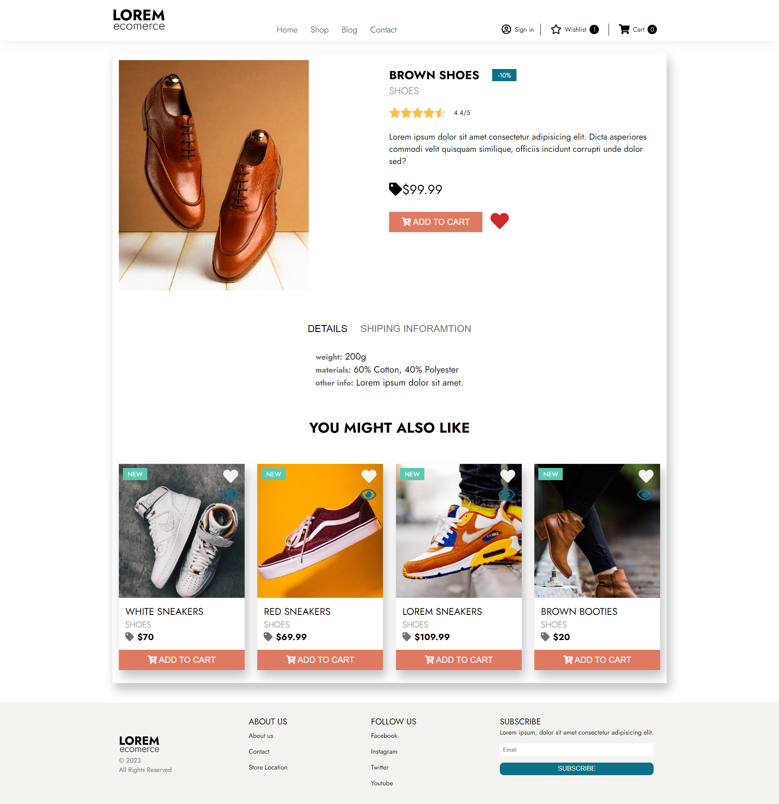
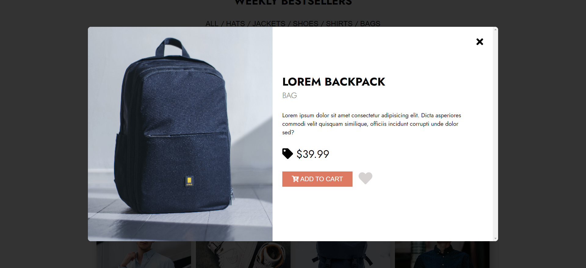
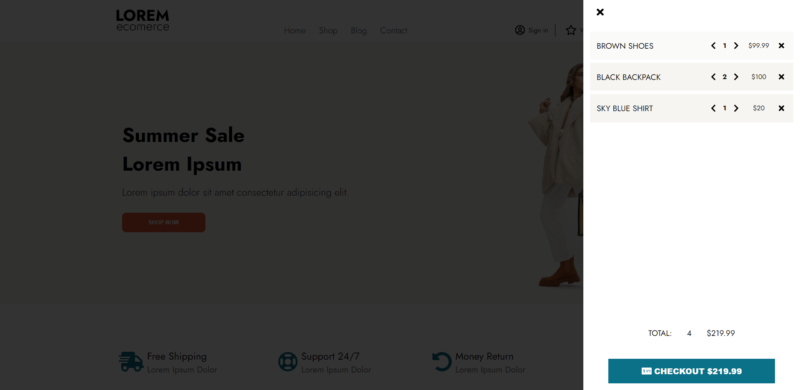

# Loremecomerce - ecomerce site

Fake ecomerce store created to practice React and styled-components.

## Table of contents

- [Overview](#overview)
  - [About](#about)
  - [Screenshot](#screenshot)
  - [Links](#links)
- [My process](#my-process)
  - [Built with](#built-with)
- [Author](#author)

## Overview

### About

In this project I created a lot of components that are use in ecomerce websites:

- Product Preview Modal
- Product Card
- Cart
- Star Rating
- Wishlist
- Checkout page

### Screenshot

### Links

- Live Site URL: [Live Stite](https://lorem-ecomerce.netlify.app/)

## My process

### Built with

- React
- Styled-components
- Framer motion
- Redux toolkit
- Toastify
- Adobe XD

## Author

- Website - [Dawid Wojtaszek](https://dawidwojtaszek.pl/)
